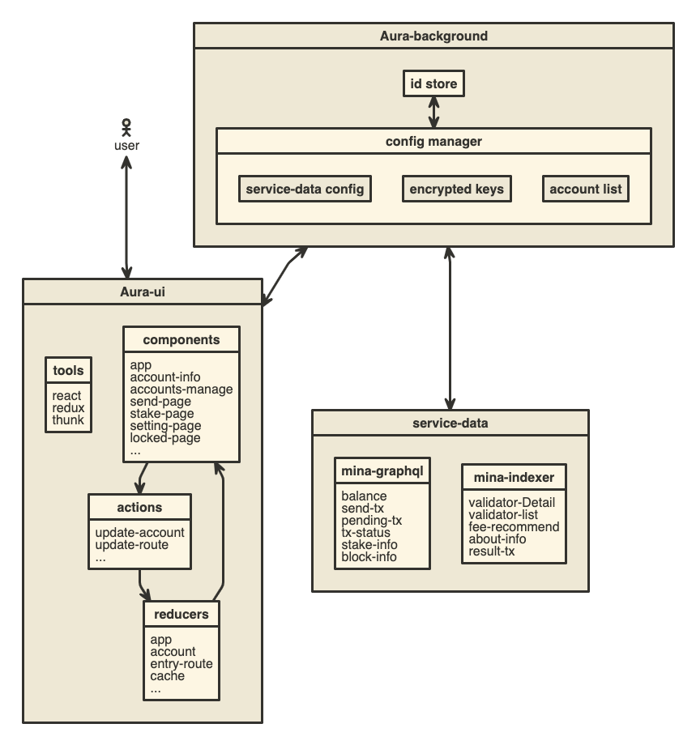

# Aura Wallet-extension

Mina Protocol browser extension wallet.

### Introduction

Aura Wallet provide one-stop management for mina assets, convenient staking, and the private key is self-owned. 


Aura Wallet is aiming to provide a more convenient entrance of the mina network.

- Friendly UI.
- Secure local accounts storage.
- Intuitive Assets management.
- Simplified staking.
- Available for Chrome.
<!-- ## Architecture
[][1] -->

### Building

## Dev
Aura Wallet extension repo uses git-secret to encrypt the endpoints and the api keys. So, you can't build this without creating your own config file. You should create your own `config.js` file in the folder. Refer to the `config.example.js` sample file to create your own configuration.
```sh
npm run dev
``` 
Extension's build output is placed in `/dist`, and you can check out [this page](https://developer.chrome.com/extensions/getstarted) for installing the developing extension.  
## LICENSE

[MIT](LICENSE)

<!-- [1]:https://www.nomnoml.com/#file/aura-extension-wallet -->